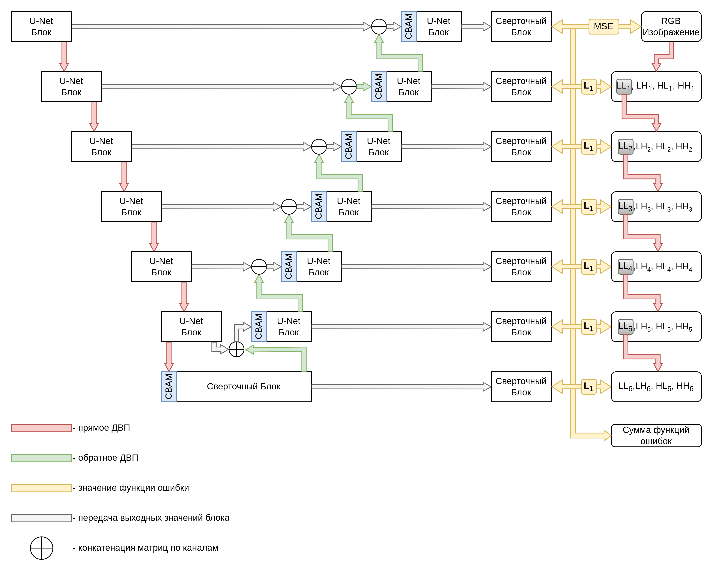

# Применение вейвлет-преобразований для построения интерпретируемой шумоподавляющей сети

Данный репозиторий содержит код для обучения модифицированной архитектуры нейронной сети IS-Net.
На изображении ниже приведена схема архитектуры сети.



### Подготовка обучающего набора данных
Для запуска обучения необходимо представить его в следующем формате:
```shell
PATH_TO_TRAIN_DATASET_FOLDER/
    ---> noisy/
        ---> train_image_1.png
        ---> train_image_2.png
        ...
        ---> train_image_N.png
    ---> clear/
        ---> train_image_1.png
        ---> train_image_2.png
        ...
        ---> train_image_N.png

PATH_TO_VALIDATION_DATASET_FOLDER/
    ---> noisy/
        ---> val_image_1.png
        ---> val_image_2.png
        ...
        ---> val_image_N.png
    ---> clear/
        ---> val_image_1.png
        ---> val_image_2.png
        ...
        ---> val_image_N.png
```
Где в директориях `clear/` должны находится изображания без шума, а в директориях `noisy/` - изображения с шумом и имеющие соответвующее имя, как у чистого файла изображения.

По данной [ссылке](https://disk.yandex.ru/d/YzKd99X_XDJK4A "Yandex Disk") можно скачать набор данных SIDD, преобразованный в используемый формат.

### Обучение модели
##### Запуск визуализации
В текущем пайплайне используется визуализация через visom, данный пакет устанавливается через пакетный менеджер pip:
```shell
pip3 install visdom
```

Запуск visdom рекомендуется делать фоновым процессом, с помощью screen или tmux.
Пример запуска visom:
```shell
visdom -port=9001
```

##### Запуск обучения
Для запуска обучения необходимо перейти в соответствующую директорию с кодом и установить необходимые зависимости:
```shell
cd research_pipelines/denoising_with_wavelets/
pip3 install -r requirements.txt
```
После установки зависимостей, можно запустить обучение. Пример консольной команды для запуска процесса обучения модели:
```shell
python3 pytorch_wavelet_train.py \
    --train_data_folder $PATH_TO_TRAIN_DATASET_FOLDER \
    --validation_data_folder $PATH_TO_VALIDATION_DATASET_FOLDER \
    --epochs 150 \
    --lr_milestones 5 \
    --image_size 512 \
    --batch_size 4 \
    --visdom 9001 \
    --njobs 4 \
    --exp $PATH_TO_EXPERIMENT_FOLDER/ \
    --preload_datasets
```

### Визулизация коэффициентов вейвлет-преобразований
Для отрисовки матриц с коэффициентами ДВП подготовлен следующий скрипт:
`research_pipelines/denoising_with_wavelets/scripts/plot_wavelets_pyramid.py`
```shell
usage: plot_wavelets_pyramid.py [-h] -m MODEL [-i IMAGE] [-o OUTPUT] [-g GAMMA_CORRECTION]

Plot wavelets

options:
  -h, --help            show this help message and exit
  -m MODEL, --model MODEL
                        Path to model checkpoint file
  -i IMAGE, --image IMAGE
                        Path to input image (optional)
  -o OUTPUT, --output OUTPUT
                        Path to folder with output visualizations (optional)
  -g GAMMA_CORRECTION, --gamma_correction GAMMA_CORRECTION
                        Coefficient to adjust gamma of wavelets coefficients visualization (optional)
```